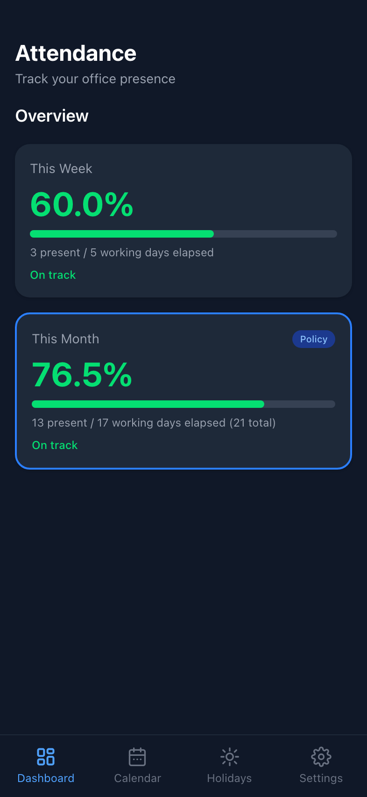
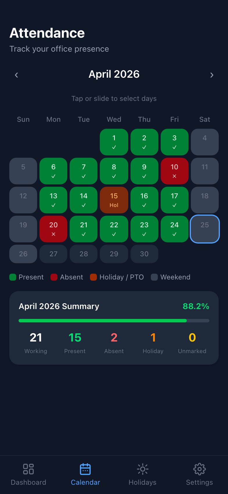
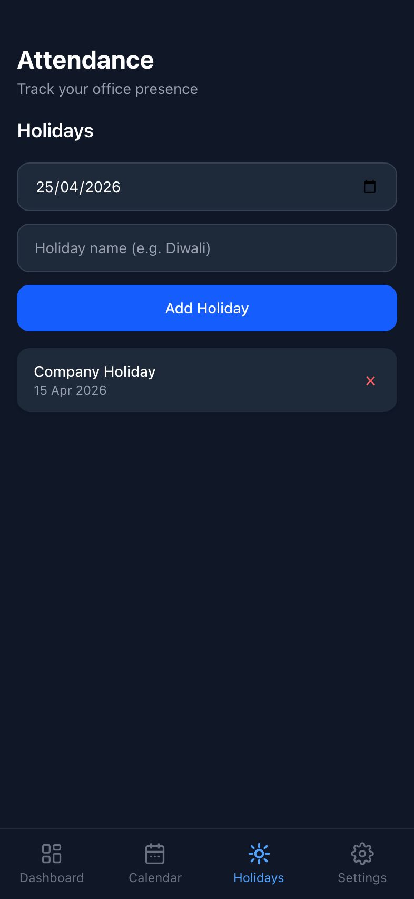
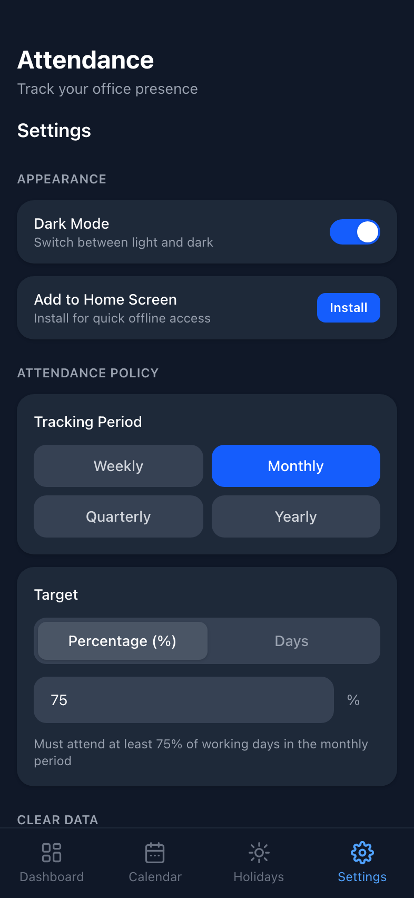
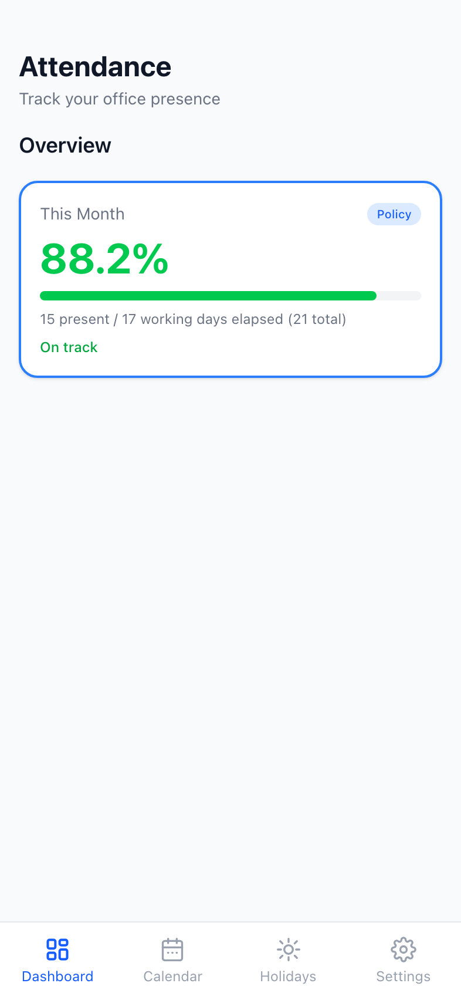
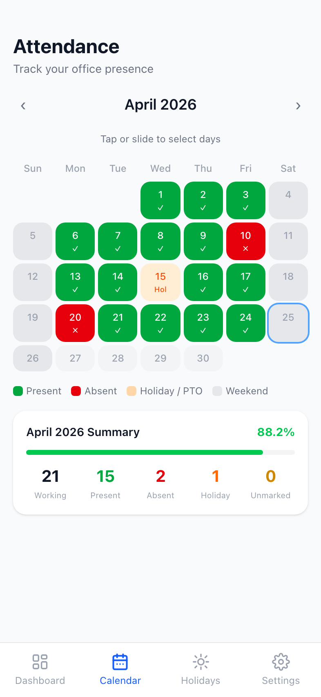
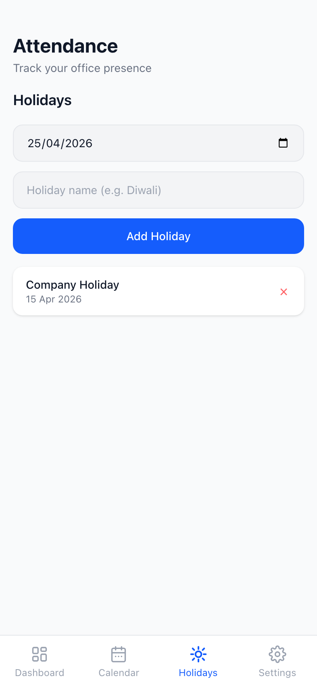
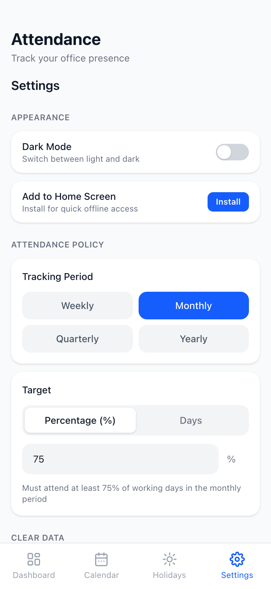
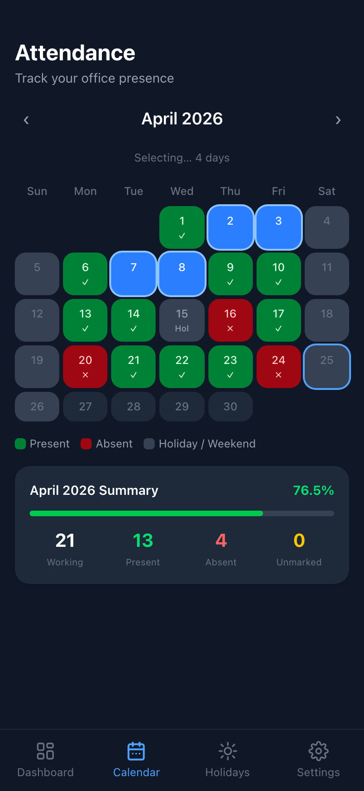
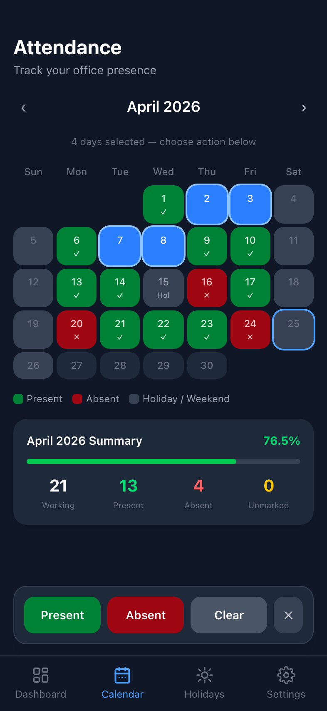

# Attendance Tracker

A mobile-first progressive web app to track your office attendance against your company's policy. Fully offline — no backend, no account, no sync required.

---

## Screenshots

### Dark Mode

| Dashboard | Calendar | Holidays | Settings |
|:---------:|:--------:|:--------:|:--------:|
|  |  |  |  |

### Light Mode

| Dashboard | Calendar | Holidays | Settings |
|:---------:|:--------:|:--------:|:--------:|
|  |  |  |  |

### Interactions

| Drag Select | Month Summary | Quarter Config |
|:-----------:|:-------------:|:--------------:|
|  |  |  |

---

## Features

### Dashboard
- **Policy card** (always visible) showing attendance % or days for your configured period — outlined in blue with a "Policy" badge
- **This Month** card shown alongside the policy card — hidden when policy period is already monthly (no duplicate)
- Color-coded progress bar and value — green when on track, red when behind
- Shows present days, elapsed working days, total working days in period, and how many more days are needed to hit the target

### Calendar
- Color-coded month grid: **green** = present, **red** = absent, **orange** = holiday / PTO, **grey** = weekend
- **Tap** a single day or **slide across** multiple days to select a range
- Floating action bar on selection: mark as **Present**, **Absent**, **Clear**, or **Holiday**
- Holiday marking prompts for a custom label (e.g. PTO, Sick Leave, Team Outing)
- **Month summary** below the grid — 5-column grid showing Working · Present · Absent · Holiday · Unmarked counts with a progress bar
- Navigate freely between months with ‹ › arrows
- Legend: Present · Absent · Holiday/PTO · Weekend

### Holidays
- **National Holidays** section — 5 India national holidays as a permanent, year-agnostic static list (never stored in the database, never duplicated):
  - New Year's Day · Jan 1
  - Republic Day · Jan 26
  - Labour Day · May 1
  - Independence Day · Aug 15
  - Gandhi Jayanti · Oct 2
- **Your Holidays** section — add custom holidays by date and name (Diwali, Holi, company holidays, PTO, etc.), sorted by date
- Delete any user-added holiday with a single tap

### Attendance Policy
Configure your company's exact attendance rule in Settings:
- **Period** — Weekly / Monthly / Quarterly / Yearly
- **Target type** — Percentage (%) or number of Days
- **Target value** — any threshold (e.g. 75%, 15 days)
- **Quarter start month** — pick any of the 12 months so the app respects your company's fiscal year (only shown when period = Quarterly)

### Clear Data
Granular controls to wipe data by period:
- Clear **attendance records** for This Week / Month / Quarter / Year
- Clear **user-added holidays** for any period (national holidays are never affected)
- Each action has an inline confirmation step before deleting

### Reset Everything
A **Danger Zone** section in Settings:
- Wipes all attendance records, all user-added holidays, and resets all settings to defaults
- Two-step confirmation (inline confirm → action)
- Success dialog confirms the reset completed

### Install on Device (PWA)
- On first launch, a prompt appears after 2.5 seconds:
  - **Android/Chrome** — native "Install" button triggers the browser's Add to Home Screen dialog
  - **iOS/Safari** — step-by-step Share → Add to Home Screen instructions
- The prompt is never shown if the app is already installed (standalone mode)
- **Settings → Appearance → Add to Home Screen** — always accessible after dismissing the auto-prompt:
  - If the browser install prompt is available: one-tap **Install** button
  - If the prompt was already dismissed: instructions to use Chrome's ⋮ menu → "Add to Home screen"
  - If on iOS: instructions to use Safari Share → "Add to Home Screen"
  - Hidden if already installed

### Appearance
- **Light / Dark mode** toggle — persists across sessions

---

## Tech Stack

| Layer | Technology | Version |
|---|---|---|
| Framework | [React](https://react.dev) | 19 |
| Build tool | [Vite](https://vite.dev) | 8 |
| Styling | [Tailwind CSS](https://tailwindcss.com) | 4 |
| Local database | [Dexie.js](https://dexie.org) (IndexedDB) | 4 |
| Hosting | [Vercel](https://vercel.com) | — |
| Language | JavaScript ESM | — |

---

## Project Structure

```
src/
├── components/
│   ├── Dashboard.jsx       # Policy card + monthly card
│   ├── CalendarView.jsx    # Color-coded calendar, drag-select, month summary
│   ├── HolidayManager.jsx  # National holidays (static) + user holidays (CRUD)
│   ├── Settings.jsx        # Policy config, quarter start, clear data, reset, install
│   └── InstallPrompt.jsx   # Add-to-home-screen banner (Android + iOS)
├── hooks/
│   ├── useAttendance.js    # All IndexedDB read/write + national holiday expansion
│   └── useSettings.js      # Policy + theme stored in localStorage
├── utils/
│   ├── workingDays.js      # Working day calculator, period bound helpers
│   ├── nationalHolidays.js # Static India national holidays list
│   └── installPrompt.js    # Shared beforeinstallprompt singleton
├── db.js                   # Dexie schema — attendance + holidays tables
├── App.jsx                 # Tab shell + bottom nav
└── index.css               # Tailwind import + global resets
public/
├── manifest.webmanifest    # PWA manifest (enables Add to Home Screen)
├── AppIcon.png             # 1024×1024 app icon (iOS home screen)
├── icon-512.png            # 512×512 icon for PWA manifest
├── icon-192.png            # 192×192 icon for PWA manifest
├── icon.svg                # Source SVG icon (purple calendar)
└── favicon.svg             # Browser tab favicon
vercel.json                 # SPA rewrite rule
screenshot.mjs              # Playwright screenshot automation
```

---

## Data Storage

All data lives in the browser's **IndexedDB** under the database name `AttendanceTracker`.

| Table | Primary Key | Fields |
|---|---|---|
| `attendance` | `date` (YYYY-MM-DD) | `status` — `"present"` or `"absent"` |
| `holidays` | `id` (auto-increment) | `date` (YYYY-MM-DD), `label` (string) |

Settings (policy + theme + quarter start) are stored in **localStorage** under the key `attendance_settings`.

National holidays are **not stored in the database** — they are a static in-memory list expanded for year ±2 and merged into `holidayDates` at runtime. On launch the app automatically purges any national holiday entries that may have been stored in a previous version.

> Data is per-browser, per-device. There is no cross-device sync.

---

## Attendance Logic

```
workingDays(start, end, holidays[])
  = all Mon–Fri in range that are not in the holiday list

attendancePercent(present, elapsed)
  = (present / elapsed) * 100

daysNeededToHitTarget(present, totalWorkingDays, target%)
  = ceil(target/100 × totalWorkingDays) − present

daysNeededToHitTarget(present, totalWorkingDays, targetDays)
  = targetDays − present
```

`elapsed` = working days from the period start up to **today** only — the percentage reflects reality, not a future projection.

**Custom quarter support:**
`getQuarterBounds(date, quarterStart)` computes the 3-month window relative to any fiscal Q1 start month, handling year-boundary rollovers automatically.

---

## Getting Started

### Prerequisites

- Node.js 18+
- npm 9+

### Run locally

```bash
git clone https://github.com/your-username/attendance-tracker.git
cd attendance-tracker
npm install
npm run dev
```

Opens at `http://localhost:5173`.

**Test on your phone** (same Wi-Fi):

```bash
# macOS — find your local IP
ipconfig getifaddr en0

# Open in your phone's browser
http://<your-ip>:5173
```

### Build for production

```bash
npm run build
# Output → dist/
```

### Capture screenshots

```bash
# With dev server already running:
node screenshot.mjs
# Output → docs/screenshots/
```

---

## Deployment

### Vercel (recommended)

**Option 1 — CLI**

```bash
npx vercel          # first deploy — interactive setup
vercel --prod       # subsequent deploys
```

**Option 2 — Git integration**

1. Push this repo to GitHub
2. Go to [vercel.com](https://vercel.com) → **New Project**
3. Import your repo — Vercel auto-detects Vite
4. Click **Deploy**

Every push to `main` triggers a redeploy. The `vercel.json` handles SPA routing so direct URL access never 404s.

---

## National Holidays (India)

The following holidays are built into the app as a static list — they apply every year with no manual setup required and are never stored in the database:

| Date | Holiday |
|---|---|
| Jan 1 | New Year's Day |
| Jan 26 | Republic Day |
| May 1 | Labour Day |
| Aug 15 | Independence Day |
| Oct 2 | Gandhi Jayanti |

All other holidays (Diwali, Holi, Eid, company-specific days, PTO) can be added manually from the **Holidays** tab.

---

## Roadmap

- [ ] PWA service worker + offline install (pending `vite-plugin-pwa` Vite 8 support)
- [ ] Export / import attendance as JSON
- [ ] Cross-device sync (requires a backend / Supabase)

---

## License

[MIT](LICENSE) © 2026 amrit-github
