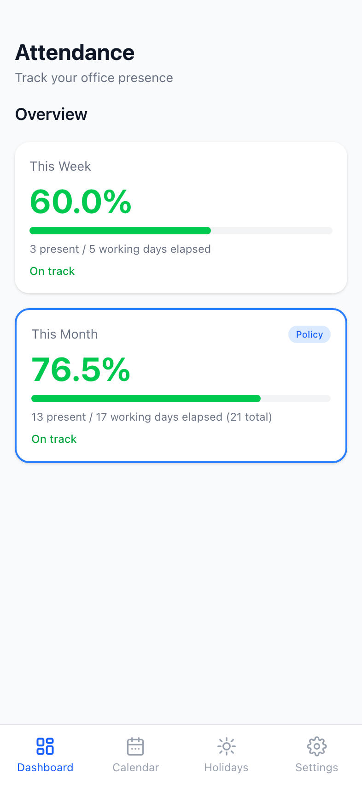
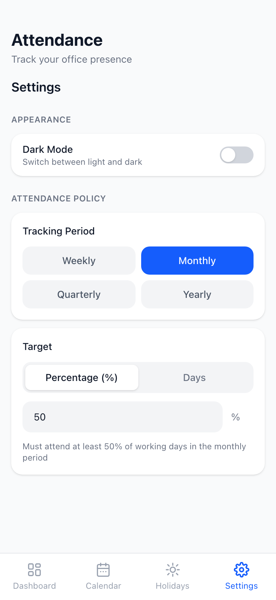

# Attendance Tracker

A mobile-first web app to track your office attendance against your company's policy — weekly, monthly, quarterly, or yearly. Built entirely offline with no backend or account required.

---

## Screenshots

| Dashboard | Calendar | Holidays | Settings |
|:---------:|:--------:|:--------:|:--------:|
|  |  |  |  |

| Light Mode | Dark Mode | Drag Select | Month Summary |
|:----------:|:---------:|:-----------:|:-------------:|
|  |  |  |  |

---

## Features

- **Dashboard** — live attendance % for the current week and month, plus your configured policy period (quarterly / yearly). Shows exactly how many more days you need to stay compliant.
- **Calendar view** — color-coded month grid (present / absent / holiday / weekend). Tap a single day or slide across multiple days to select, then mark them all at once via a floating action bar.
- **Holiday manager** — add and delete holidays by date and name. Holidays are excluded from working day calculations and shown in grey on the calendar.
- **Configurable attendance policy** — set your company's rule: choose the period (weekly / monthly / quarterly / yearly), target type (percentage or number of days), and the threshold value.
- **Light & dark mode** — toggle in Settings, persists across sessions.
- **Month summary** — scroll below any month's calendar to see working days, present, absent, and unmarked counts with a progress bar.
- **Fully offline** — all data stored in IndexedDB via Dexie. No login, no server, no sync required.
- **Mobile-optimised** — safe area insets for iPhone notch and home bar, dynamic viewport height, tap highlight suppression, smooth drag-select with pointer and touch events.

---

## Tech Stack

| Layer | Technology | Version |
|---|---|---|
| Framework | [React](https://react.dev) | 19 |
| Build tool | [Vite](https://vite.dev) | 8 |
| Styling | [Tailwind CSS](https://tailwindcss.com) | 4 |
| Local database | [Dexie.js](https://dexie.org) (IndexedDB) | 4 |
| Hosting | [Vercel](https://vercel.com) | — |
| Language | JavaScript ESM | — |

---

## Project Structure

```
src/
├── components/
│   ├── Dashboard.jsx       # Weekly / monthly / policy stat cards
│   ├── CalendarView.jsx    # Color-coded calendar + drag-select + month summary
│   ├── HolidayManager.jsx  # Add / delete holidays
│   └── Settings.jsx        # Policy config + theme toggle
├── hooks/
│   ├── useAttendance.js    # All IndexedDB read/write logic
│   └── useSettings.js      # Policy + theme stored in localStorage
├── utils/
│   └── workingDays.js      # Working day calculator, period bound helpers
├── db.js                   # Dexie schema — attendance + holidays tables
├── App.jsx                 # Tab shell + bottom nav
└── index.css               # Tailwind import + global resets
vercel.json                 # SPA rewrite rule for Vercel
```

---

## Data Storage

All data lives in the browser's **IndexedDB** under the database name `AttendanceTracker`.

| Table | Primary Key | Fields |
|---|---|---|
| `attendance` | `date` (YYYY-MM-DD) | `status` — `"present"` or `"absent"` |
| `holidays` | `id` (auto-increment) | `date` (YYYY-MM-DD), `label` (string) |

Settings (policy + theme) are stored in **localStorage** under the key `attendance_settings`.

> Data is per-browser, per-device. There is no cross-device sync.

---

## Getting Started

### Prerequisites

- Node.js 18+
- npm 9+

### Run locally

```bash
# Clone
git clone https://github.com/your-username/attendance-tracker.git
cd attendance-tracker

# Install
npm install

# Start dev server (exposed on local network for mobile testing)
npm run dev
```

Opens at `http://localhost:5173`.

**Test on your phone** (same Wi-Fi network):

```bash
# macOS — find your local IP
ipconfig getifaddr en0

# Open in your phone's browser
http://<your-ip>:5173
```

### Build for production

```bash
npm run build
# Output → dist/
```

---

## Deployment

### Vercel (recommended)

**Option 1 — CLI**

```bash
npx vercel          # first deploy — interactive setup
vercel --prod       # subsequent deploys
```

**Option 2 — Git integration**

1. Push this repo to GitHub
2. Go to [vercel.com](https://vercel.com) → **New Project**
3. Import your repo — Vercel auto-detects Vite
4. Click **Deploy**

Every push to `main` triggers a redeploy automatically. The `vercel.json` at the root handles SPA routing so direct URL access and page refreshes never 404.

---

## Attendance Logic

```
workingDays(start, end, holidays[])
  = all Mon–Fri in range that are not in the holiday list

attendancePercent(present, elapsed)
  = (present / elapsed) * 100

daysNeededToHitTarget(present, totalWorkingDays, target%)
  = ceil(target/100 × totalWorkingDays) − present

daysNeededToHitTarget(present, totalWorkingDays, targetDays)
  = targetDays − present
```

`elapsed` = working days from the period start up to **today only** (not the full period end), so the percentage reflects reality rather than projecting into the future.

---

## Roadmap

- [ ] PWA install prompt + offline service worker (pending `vite-plugin-pwa` Vite 8 support)
- [ ] Daily 9 AM push notification — *"Did you go to office today?"*
- [ ] Export / import attendance as JSON (for backup and device transfer)
- [ ] Cross-device sync (requires a backend / Supabase)

---

## License

MIT
